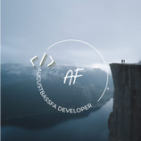

# CoreCodeio-FranciscoAugust-AugustBassFa 💻

<h1 align="center">README</h1>

   «Nadie debe empezar un proyecto grande. Empiezas con uno pequeño y trivial y nunca debes esperar que crezcan; si lo haces solamente sobre-diseñarás y generalmente pensarás que es más importante de lo que lo es en esta etapa. O peor, puedes asustarte por el tamaño de lo que tu esperas que crezca. Así que empieza pequeño y piensa en los detalles. No pienses acerca de la foto grande y el diseño elegante. Si no resuelve una necesidad inmediata, seguramente está sobrediseñado. Y no esperes que la gente salte a ayudarte, no es así como estas cosas funcionan. Primero debes tener algo medianamente usable y otros dirán «hey, esto casi funciona para mí» y se involucrarán en el proyecto.»
    
<b>Linus Troval</b>

## Description 📜

Here I record everything learned in the "Core Code-io BootCamp", it is the place where all the solved exercises will be kept under control.

## Week Challenges 🚀

1.  Tuesday 19/07/2022 [1️⃣](https://github.com/augustbassfa/core-code-from-scratch-readme-augustbassfa/blob/main/SemanaChallenges/Martes190722/1%20activity.md) [2](fff)

## My Social Networks 👍🏻

1. [Facebook](https://facebook.com/augustbassfa)
2. [Instagram](https://instagram.com/augustbassfa)
3. [Twitter](https://twitter.com/augustbassfa)

## More About Me 🎸🎮🥇

I am currently studying on my own about "Object Oriented Programming", and also some "Web Page Design"
If you want to see how my page is doing:
[My Web Site](https://augustfrancisco.me)

## Helpful Resources 📖

1. [My-Books](....)
2. [CodeWars](https://www.codewars.com/)
